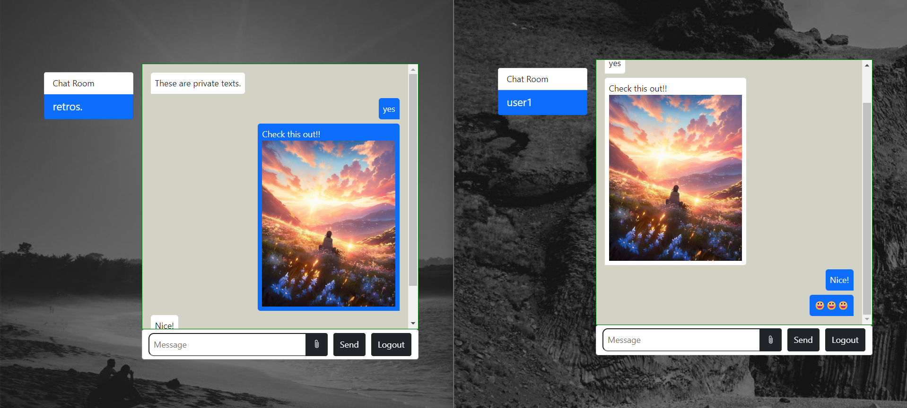

# Chat UI React

Welcome to the Chat UI React repository! This frontend application is built using React for the user interface of the real-time chat application.

## Tech Stack and Dependencies
- **React**: JavaScript library for building user interfaces.
- **React DOM**: Entry point to the React DOM library for web applications.
- **React Router DOM**: Declarative routing for React.
- **Bootstrap**: Frontend framework for designing responsive and mobile-first websites.
- **SockJS-Client**: WebSocket emulation library.
- **Stomp-WebSocket**: WebSocket client for STOMP protocol.
- **StompJS**: JavaScript library providing a STOMP client for Web browsers.

### Dependencies
```json
{
  "bootstrap": "^5.3.0",
  "react": "^18.2.0",
  "react-dom": "^18.2.0",
  "react-router-dom": "^5.3.4",
  "sockjs-client": "^1.6.1",
  "stomp-websocket": "^2.3.4-next",
  "stompjs": "^2.3.3"
}
```

### Dev Dependencies
```json
{
  "@types/react": "^18.0.37",
  "@types/react-dom": "^18.0.11",
  "@types/react-router-dom": "^5.3.3",
  "@vitejs/plugin-react": "^4.0.0",
  "eslint": "^8.38.0",
  "eslint-plugin-react": "^7.32.2",
  "eslint-plugin-react-hooks": "^4.6.0",
  "eslint-plugin-react-refresh": "^0.3.4",
  "vite": "^4.3.9"
}
```

## Why Use Chat UI React?
- **React Framework**: Utilizing React for building the user interface ensures component-based development and a fast rendering process.
- **Bootstrap Integration**: Bootstrap is integrated for designing responsive and visually appealing UI components.
- **WebSocket Communication**: SockJS-Client, Stomp-WebSocket, and StompJS are used for WebSocket communication, facilitating real-time messaging in the chat application.

## Screenshots
Here are some screenshots of the chat application:

1. Chat Page


2. Multimedia Transfer


## Backend Repository
For the backend server of the chat application, please refer to the [Chat Backend](https://github.com/ashavijit/chat-backend) repository.

Feel free to explore and contribute to this project! If you have any questions or suggestions, please open an issue or submit a pull request.

Happy chatting! 🚀


Make sure to replace `screenshots/screenshot1.png`, `screenshots/screenshot2.png`, and `screenshots/screenshot3.png` with the actual paths to your screenshots within the `screenshots` folder.

Happy chatting! 🚀

# Developer Profile

<div style="display: flex; align-items: center;">
  <div style="flex: 20 20 60px; height: 60px;">
    
  </div>
  <div style="margin-left: 10px;">
    <p>
      <strong>Name:</strong> Avijit Sen<br>
      <strong>Username:</strong> ashbijit<br>
      <strong>Email:</strong> avijitsen.me@gmail.com<br>
      <strong>Bio:</strong> Software Developer passionate about creating meaningful applications.
    </p>
    <p>
      Feel free to reach out for collaboration or discussions!
    </p>
  </div>
</div>

